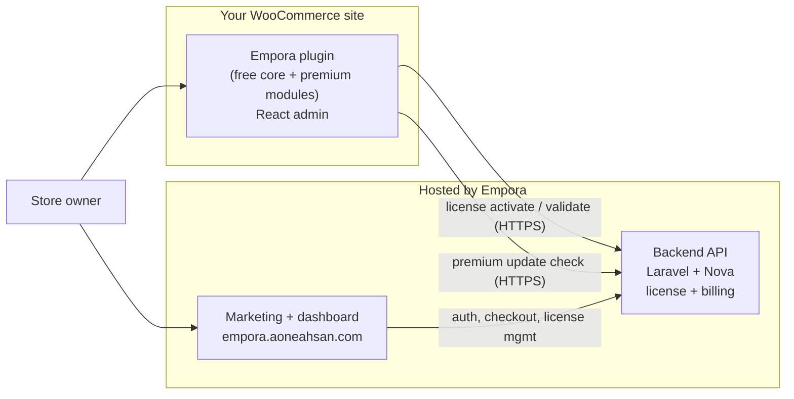

# Architecture

Empora is a small ecosystem. This page explains how the pieces fit together so developers and technical store owners know what runs where.

## The three surfaces

You install only the **plugin**. The **web app** and **API** are hosted services.

## 1. The WordPress plugin

The plugin (`empora-for-woocommerce`) is organised around a **module registry**:

- Each feature lives in its own module directory under `includes/Modules/` (90+ modules).
- A module implements a common interface (`ModuleInterface` / `AbstractModule`) and is registered with the `ModuleRegistry`.
- Enabling a module (from the Modules grid) registers its hooks, REST routes, and front-end behaviour; disabling it unregisters them — cleanly, without deleting data.
- Settings for every module are stored behind one option (`aiowc_module_settings`).
- A **REST layer** (namespace `aiowc/v1`) exposes per-module endpoints that the React admin calls.
- A **Dashboard** with a config checker surfaces pending-setup items (`ok` / `todo`).
- A **License** client activates/validates against the backend and gates premium modules by entitlement.
- A premium **Updater** checks the backend for updates of the premium build.

The admin UI is a **React** application (built with Vite) embedded in the WordPress admin, talking to the plugin's REST endpoints.

## 2. The marketing + dashboard web app

A **React 19 + Vite + TanStack Router** application (`empora.aoneahsan.com`) that serves:

- Marketing pages (home, features, pricing, changelog).
- Documentation and legal pages.
- A signed-in **dashboard** to manage your license and connected stores.
- A set of free client-side utility tools.

A **Capacitor** wrapper packages this same web build into a mobile app shell (Android/iOS projects are committed; mobile is a thin wrapper around the web experience).

## 3. The backend API

A **Laravel 12 + Nova 5** application providing:

- **Auth** (Sanctum tokens; email/password + Google).
- **License** issuance, activation, validation, and deactivation.
- **Billing** (Stripe checkout + webhooks) and subscription/entitlement management.
- **Update** checks for the premium plugin build.
- **Health** endpoints for monitoring.

See the [REST API](/reference/rest-api) and [License API](/reference/license-api) references for the concrete endpoints.

## Shared packages

The monorepo also contains shared TypeScript packages (UI primitives, Firebase auth helpers, observability, FilesHub upload wrapper, shared types) reused by the web app and plugin admin.

## Why a module registry

The registry pattern is what lets Empora be "all-in-one" without being a monolith: stores enable only what they need, each module is independently testable, and the free/premium split is enforced in one place (entitlements) rather than scattered across the codebase.

## Related

- [REST API](/reference/rest-api)
- [License API](/reference/license-api)
